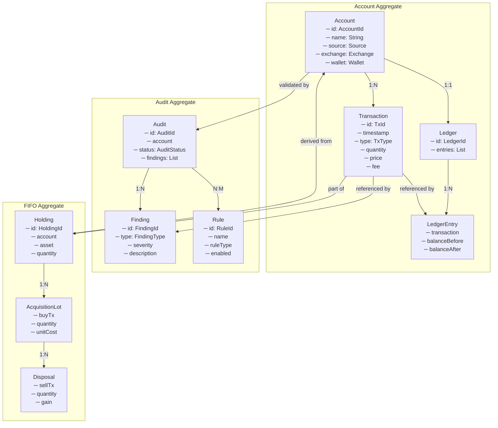
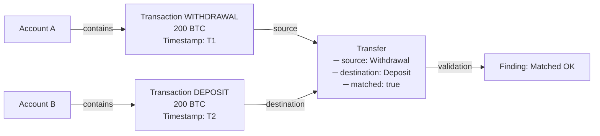

# Modelo de Dominio - CoinTracking Expert Framework

**Especificación del Modelo de Dominio Completo**

---

## Propósito

Este documento define el modelo de dominio del framework CoinTracking Expert, proporcionando una especificación precisa de todas las entidades, sus responsabilidades, relaciones, restricciones y comportamientos. El modelo es la fuente de verdad para todas las decisiones arquitectónicas y de implementación.

El modelo de dominio describe cómo el sistema:
- Representa transacciones de criptomonedas
- Reconstruye saldos y tenencias
- Detecciona duplicados y transferencias huérfanas
- Calcula costos de adquisición usando FIFO
- Valida consistencia de datos
- Genera reportes de auditoría

---

## Principios de Diseño

### 1. **Separación de Responsabilidades**

Cada entidad tiene una única responsabilidad bien definida. Las transacciones representan eventos; los ledgers reconstruyen estado; los audits detectan inconsistencias.

### 2. **Independencia de Fuente**

El modelo es agnóstico respecto a fuentes de datos (CSV, API, manual). La normalización convierte todo a representación canónica.

### 3. **Reproducibilidad Determinista**

Idénticas entradas producen idénticas salidas. No hay estado no-determinista. Todas las decisiones están basadas en datos observables.

### 4. **Trazabilidad Completa**

Toda conclusión es rastreable hasta sus datos de origen. Cada finding documenta evidencia, causa e impacto.

### 5. **Inmutabilidad de Datos Históricos**

Las transacciones y eventos históricos nunca se modifican. Solo se pueden agregar nuevas transacciones o correcciones explícitas.

### 6. **Validación en Límites**

Las validaciones ocurren en los límites del sistema (import). El sistema interno confía en datos ya validados.

### 7. **Modelado Explícito de Incertidumbre**

La incertidumbre se modela explícitamente como findings. El silencio nunca implica corrección.

---

## Descripción General del Dominio

### Contexto de Negocio

CoinTracking Expert valida bases de datos de CoinTracking verificando que sean:
- **Completas**: Todas las transacciones están registradas
- **Consistentes**: Los saldos son matemáticamente correctos
- **Reconciliables**: Los transfers se pueden emparejar
- **Auditables**: Cada conclusión se puede reproducir

### Flujo de Procesos Principales

#### 1. Flujo de Auditoría

```
Exportación CoinTracking
           ↓
    Importación & Normalización
           ↓
    Motor de Reconciliación
           ↓
    Motores Especializados ────┬─→ Motor de Duplicados
                               ├─→ Motor de Transfers
                               ├─→ Motor de Ledger
                               ├─→ Motor de Tenencias
                               ├─→ Motor FIFO
                               └─→ Motor de Impuestos
           ↓
    Síntesis de Findings
           ↓
    Generación de Reportes
```

#### 2. Flujo de Reconciliación

```
Ledger Completo
       ↓
Procesamiento Cronológico
       ↓
Cálculo de Saldos
       ↓
Detección de Balances Negativos
       ↓
Validación de Consistencia
```

#### 3. Flujo FIFO

```
Transacciones Compra/Venta
       ↓
Ordenamiento Cronológico
       ↓
Asignación de Lotes
       ↓
Cálculo de Costo Base
       ↓
Detección de Compras Faltantes
```

#### 4. Flujo de Generación de Reportes

```
Findings Consolidados
       ↓
Deduplicación & Ranking
       ↓
Síntesis de Narrativa
       ↓
Formateo Multi-Formato
       ↓
Reportes Finales
```

---

## Entidades del Núcleo

### 1. Transaction (Transacción)

#### Propósito

Representa un evento atómico que afecta el saldo de un activo en una cuenta. Es la unidad fundamental del análisis.

#### Responsabilidades

- Registrar exactamente qué sucedió, cuándo y dónde
- Mantener trazabilidad con sistemas de origen
- Representar el evento en forma normalizada
- Participar en cálculos de saldo y FIFO

#### Atributos Requeridos

```
id: TransactionId
    - Identificador único único dentro del dominio
    - Generado por el sistema, no por fuente de datos
    - Inmutable

sourceId: SourceTransactionId
    - ID en sistema de origen (CoinTracking, exchange, blockchain)
    - Puede no ser único entre fuentes
    - Requerido para trazabilidad

timestamp: Timestamp
    - Momento exacto cuando ocurrió
    - Precisión: segundo o milisegundo
    - Zona horaria: UTC normalizado

transactionType: TransactionType
    - Enumeración: BUY, SELL, DEPOSIT, WITHDRAWAL, TRANSFER, 
                   STAKING_REWARD, AIRDROP, FEE, DUST, OTHER
    - No nulo

account: Account (referencia)
    - Cuenta donde ocurrió la transacción
    - Relación: muchas transacciones por cuenta

asset: Asset (referencia)
    - Qué se está moviendo
    - Bitcoin, Ethereum, USDT, etc.

quantity: Quantity
    - Cantidad transada
    - Puede ser positivo (entrada) o negativo (salida)
    - Precisión: hasta 18 decimales

price: Money (opcional)
    - Precio unitario al momento de la transacción
    - Moneda: típicamente USD

totalValue: Money (calculado)
    - quantity × price
    - Se calcula si price está disponible

fee: Fee (opcional)
    - Comisión pagada
    - Puede expresarse como cantidad o como dinero

feeAsset: Asset (opcional)
    - En qué activo se pagó la comisión
    - Puede diferir del asset principal

source: DataSource
    - Enumeración: COINTRACKING_CSV, COINTRACKING_API, 
                   EXCHANGE_API, BLOCKCHAIN, MANUAL
    - Indica de dónde vino el dato

status: TransactionStatus
    - Enumeración: CONFIRMED, PENDING, FAILED, DISPUTED
    - Por defecto: CONFIRMED

notes: String (opcional)
    - Anotaciones del usuario o del sistema
    - Para recordar contexto o razones

externalReference: Hash (opcional)
    - Hash de blockchain, ID de exchange, etc.
    - Para trazabilidad completa

```

#### Atributos Opcionales

```
description: String
    - Descripción legible
    - Ejemplo: "Buy ETH on Binance"

tags: List<String>
    - Para categorización flexible
    - Ejemplo: ["margin", "leveraged", "problematic"]

metadata: Map<String, Any>
    - Datos arbitrarios de origen
    - Preserva información específica de fuente

relatedTransactions: List<TransactionId>
    - IDs de transacciones relacionadas
    - Ejemplo: una venta relacionada con una compra

```

#### Restricciones

1. **Cantidad debe ser consistente con tipo**
   - BUY: quantity > 0
   - SELL: quantity < 0
   - DEPOSIT: quantity > 0
   - WITHDRAWAL: quantity < 0
   - TRANSFER: puede ser positivo o negativo según perspectiva
   - STAKING_REWARD: quantity > 0
   - AIRDROP: quantity > 0
   - FEE: quantity < 0

2. **Timestamp debe ser válido**
   - No puede ser en el futuro
   - No puede ser anterior a genesis de blockchain (genesis de Bitcoin: 2009-01-03)

3. **Account y Asset requeridas**
   - Ninguna transacción puede estar "huérfana"

4. **Precisión de Cantidad**
   - Máximo 18 decimales (estándar ERC-20)
   - No debe ser cero

5. **Fee no puede ser negativo**
   - Siempre costo para el usuario

#### Ciclo de Vida

```
Created → Imported → Validated → Processed → Finalized
                         ↓
                    On Error: Disputed
```

**Created**: Sistema crea instancia
**Imported**: Datos del origen
**Validated**: Pasa validaciones de esquema
**Processed**: Incluido en cálculos
**Finalized**: Inmutable para reportes
**Disputed**: Marcado como problemático

#### Relaciones

```
Transaction
    ├─→ Account (many-to-one)
    │      └─ Exactamente una cuenta
    │
    ├─→ Asset (many-to-one)
    │      └─ Exactamente un activo transado
    │
    ├─→ Asset (many-to-one, opcional)
    │      └─ Activo de comisión
    │
    ├─→ LedgerEntry (one-to-one)
    │      └─ Cada transacción tiene entrada en ledger
    │
    ├─→ Transfer (one-to-one, si aplica)
    │      └─ Si es TRANSFER, es parte de Transfer
    │
    ├─→ Trade (one-to-one, si aplica)
    │      └─ Si es BUY o SELL, es parte de Trade
    │
    └─→ List<Finding> (many-to-many)
           └─ Puede ser evidencia de múltiples findings
```

#### Invariantes

```
Invariante 1: Identificador único
    ∀ t1, t2 ∈ Transaction: t1.id = t2.id → t1 = t2

Invariante 2: Integridad de referencia
    ∀ t ∈ Transaction: t.account ≠ null ∧ t.asset ≠ null

Invariante 3: Timestamp consistente
    timestamp(t) ≤ now()

Invariante 4: Suma de comisión válida
    fee > 0 ∨ fee = null

Invariante 5: No puede modificarse después de validación
    status ∈ {CONFIRMED, FINALIZED} → inmutable
```

---

### 2. Asset (Activo)

#### Propósito

Representa una clase de criptomoneda o token. Es el "qué" de cada transacción.

#### Responsabilidades

- Identificar únicamente cada activo
- Mantener metadatos esenciales
- Facilitar identificación cruzada entre fuentes
- Participar en cálculos de cantidad y valor

#### Atributos Requeridos

```
symbol: AssetSymbol (identificador de dominio)
    - Ticker universal
    - Ejemplos: BTC, ETH, USDT, SOL, MATIC
    - Máximo 10 caracteres
    - Upper case siempre

name: String
    - Nombre legible
    - Ejemplos: "Bitcoin", "Ethereum", "Tether USD"

type: AssetType
    - Enumeración: CRYPTOCURRENCY, STABLECOIN, FIAT, TOKEN, NFT
    - Por defecto: CRYPTOCURRENCY

network: Network (opcional)
    - Red blockchain donde existe
    - Ejemplos: ETHEREUM, SOLANA, POLYGON
    - Nulo para activos sin red específica (BTC)

contractAddress: Address (opcional)
    - Dirección de contrato inteligente
    - Para tokens ERC-20, BEP-20, etc.
    - Específico de red

decimals: Integer
    - Decimales standard
    - Bitcoin: 8, Ethereum: 18, USDC: 6
    - Por defecto: 18

```

#### Atributos Opcionales

```
coingeckoId: String
    - ID en CoinGecko para obtener precios
    
coinmarketcapId: String
    - ID en CoinMarketCap

issuedDate: Timestamp
    - Cuándo se creó/lanzó

totalSupply: Quantity
    - Suministro total (si conocido)

website: String
    - URL oficial del proyecto

category: String
    - Categorización: DeFi, Layer-2, Stablecoin, etc.

deprecated: Boolean
    - Si el activo ya no es relevante

aliases: List<String>
    - Símbolos alternativos
    - Ejemplo: "Tether USD" también es "USDT.e" en Avalanche

```

#### Restricciones

1. **Symbol único en dominio**
   - Un BTC representa todos los bitcoins
   - Pero se puede tener WBTC (wrapped Bitcoin)

2. **Symbol válido**
   - Solo caracteres alfanuméricos
   - No espacios

3. **ContractAddress requiere Network**
   - Si está presente, Network también debe estarlo

4. **Decimals entre 0 y 18**
   - Prácticamente ningún asset tiene más de 18

#### Relaciones

```
Asset
    ├─→ Network (many-to-one, opcional)
    │
    ├─→ List<Transaction> (one-to-many)
    │      └─ Todos los movimientos de este activo
    │
    ├─→ List<Holding> (one-to-many)
    │      └─ Tenencias actuales
    │
    ├─→ List<AcquisitionLot> (one-to-many)
    │      └─ Lotes de adquisición
    │
    └─→ List<Price> (one-to-many)
           └─ Histórico de precios
```

#### Identidad

```
Asset se identifica por:
    - symbol: AssetSymbol
    - network: Network (si aplica)
    
Clave única compuesta: (symbol, network)

Ejemplos:
    - (BTC, null) = Bitcoin
    - (USDT, ETHEREUM) = Tether en Ethereum
    - (USDT, POLYGON) = Tether en Polygon
```

---

### 3. Exchange (Intercambio)

#### Propósito

Representa una plataforma de intercambio de criptomonedas. Agrupa todas las cuentas en esa plataforma.

#### Responsabilidades

- Identificar plataforma de origen
- Mantener metadatos de integración
- Facilitar auditoría de datos de origen
- Participar en matching de transferencias

#### Atributos Requeridos

```
id: ExchangeId (identificador de dominio)
    - Único, generado por sistema
    - Ejemplos: BINANCE, COINBASE, KRAKEN

name: String
    - Nombre legible
    - Ejemplos: "Binance", "Coinbase", "Kraken"

type: ExchangeType
    - Enumeración: CENTRALIZED, DECENTRALIZED, DEX, BRIDGE
    - Por defecto: CENTRALIZED

supportedAssets: List<Asset>
    - Activos que soporta
    - Para validación cruzada

supportedNetworks: List<Network>
    - Redes blockchain soportadas

```

#### Atributos Opcionales

```
apiEndpoint: String
    - URL de API (si integrado)

website: String
    - Sitio web oficial

country: String
    - País de regulación

regulatedStatus: RegulatoryStatus
    - Enumeración: REGULATED, UNREGULATED, PENDING

supportedDataFormats: List<DataFormat>
    - CSV, JSON, XML, etc.
    - Qué formatos de export ofrece

```

#### Relaciones

```
Exchange
    ├─→ List<Account> (one-to-many)
    │      └─ Todas las cuentas en este exchange
    │
    ├─→ List<Asset> (many-to-many)
    │      └─ Activos que soporta
    │
    └─→ List<Network> (many-to-many)
           └─ Redes que soporta
```

#### Identidad

Exchange se identifica por:
```
- id: ExchangeId (único en dominio)
```

---

### 4. Wallet (Billetera)

#### Propósito

Representa una billetera blockchain (hardware, software, multi-sig). Es una forma de custodiar activos.

#### Responsabilidades

- Identificar billetera específica
- Mantener direcciones blockchain
- Facilitar matching de transacciones blockchain
- Participar en auditoría de tenencias

#### Atributos Requeridos

```
id: WalletId (identificador de dominio)
    - Único en dominio
    - Generado por sistema

name: String
    - Nombre legible
    - Ejemplo: "Hardware Wallet 1", "Ledger Live"

type: WalletType
    - Enumeración: HARDWARE, SOFTWARE, MULTISIG, 
                   HARDWARE_ABSTRACTION_LAYER, OTHER
    
network: Network
    - Red blockchain primaria
    - Ejemplo: ETHEREUM, SOLANA

addresses: List<Address>
    - Direcciones blockchain de esta billetera
    - Puede tener múltiples direcciones

```

#### Atributos Opcionales

```
provider: String
    - Manufacturer o software
    - Ejemplo: "Ledger", "Trezor", "MetaMask"

isMultisig: Boolean
    - Si requiere múltiples firmas

requiredSignatures: Integer
    - Si es multisig, cuántas se requieren

totalAddresses: Integer
    - Cantidad de direcciones potenciales

notes: String
    - Anotaciones del usuario

```

#### Relaciones

```
Wallet
    ├─→ Network (many-to-one)
    │      └─ Red blockchain principal
    │
    ├─→ List<Address> (one-to-many)
    │      └─ Direcciones de esta billetera
    │
    └─→ List<Account> (one-to-many)
           └─ Cuentas asociadas (en CoinTracking)
```

---

### 5. Account (Cuenta)

#### Propósito

Representa un contenedor de transacciones. Típicamente es una cuenta en un exchange, billetera, o aggregador como CoinTracking.

Es el agregado raíz principal para transacciones.

#### Responsabilidades

- Agrupar transacciones coherentemente
- Mantener trazabilidad de origen
- Participar en cálculos de saldo
- Facilitar auditoría segregada por cuenta

#### Atributos Requeridos

```
id: AccountId (identificador de dominio)
    - Único en dominio
    - Generado por sistema

name: String
    - Nombre legible
    - Ejemplo: "Binance Main", "Ledger Wallet 1"

source: AccountSource
    - Enumeración: EXCHANGE, WALLET, COINTRACKING, AGGREGATOR
    - Tipo de origen

exchange: Exchange (referencia, si aplicable)
    - Si es EXCHANGE, referencia a Exchange
    
wallet: Wallet (referencia, si aplicable)
    - Si es WALLET, referencia a Wallet

transactions: List<Transaction> (composición)
    - Todas las transacciones de esta cuenta
    - Responsabilidad exclusiva de Account

ledger: Ledger
    - Ledger de esta cuenta
    - Reconstruye saldos de transacciones

```

#### Atributos Opcionales

```
externalId: String
    - ID en sistema de origen
    - Ejemplo: usuario de exchange

status: AccountStatus
    - Enumeración: ACTIVE, ARCHIVED, SUSPENDED, CLOSED
    - Por defecto: ACTIVE

lastSyncTime: Timestamp
    - Última sincronización de datos

importedFrom: String
    - Formato de importación original
    - "CoinTracking CSV", "Binance API", etc.

```

#### Restricciones

1. **Exactamente uno de Exchange o Wallet**
   - Una Account es O de un exchange O de una billetera
   - O ambos nulos para COINTRACKING/AGGREGATOR

2. **Transactions no pueden ser nulas**
   - Lista puede estar vacía, pero nunca null

3. **Ledger sincronizado con Transactions**
   - Invariante: ledger.entries proviene de transactions

#### Ciclo de Vida

```
Created → Imported → Synced → Active → Archived
                       ↓
                 (periódicamente updated)
```

#### Relaciones

```
Account (Agregado Raíz)
    ├─→ Exchange (many-to-one, opcional)
    │
    ├─→ Wallet (many-to-one, opcional)
    │
    ├─→ List<Transaction> (one-to-many, composición)
    │      └─ Propiedad exclusiva
    │
    ├─→ Ledger (one-to-one, composición)
    │      └─ Computado desde transactions
    │
    ├─→ List<Holding> (one-to-many)
    │      └─ Tenencias actuales
    │
    └─→ List<Transfer> (one-to-many)
           └─ Transfers a/desde esta cuenta
```

#### Invariantes

```
Invariante 1: Identidad
    ∀ a1, a2 ∈ Account: a1.id = a2.id → a1 = a2

Invariante 2: Exactamente una fuente
    (exchange ≠ null XOR wallet ≠ null) ∨ (exchange = null ∧ wallet = null)

Invariante 3: Transacciones inmutables históricamente
    Para t ∈ transactions donde t.timestamp < now - 90 días:
        t es inmutable

Invariante 4: Ledger derivado
    ledger.entries es función pura de transactions
```

---

### 6. Ledger (Libro Mayor)

#### Propósito

Reconstruye el saldo de cada activo en una cuenta a lo largo del tiempo. Es el estado derivado de todas las transacciones.

#### Responsabilidades

- Procesar transacciones cronológicamente
- Mantener saldos corrientes para cada activo
- Detectar estados imposibles (balances negativos)
- Facilitar validación de consistencia

#### Atributos Requeridos

```
id: LedgerId
    - Único, típicamente derivado de Account.id

account: Account (referencia)
    - A qué cuenta pertenece

entries: List<LedgerEntry> (composición)
    - Entrada para cada transacción
    - Ordenado cronológicamente
    - Nunca vacío si account tiene transacciones

assetBalances: Map<Asset, Quantity>
    - Saldo actual para cada activo
    - Derivado del último entry de cada activo
    - Actualizado incrementalmente

```

#### Atributos Opcionales

```
lastUpdated: Timestamp
    - Cuándo se calculó por última vez

isValid: Boolean
    - Si no hay estados imposibles
    - Por defecto true, se marca false si hay negatives

```

#### Restricciones

1. **Entries ordenadas cronológicamente**
   - entries[i].timestamp ≤ entries[i+1].timestamp

2. **Entries corresponden a Transactions**
   - Cada transaction tiene exactamente un entry
   - No hay entries huérfanas

3. **assetBalances consistentes**
   - Para cada asset: balance = sum de entries de ese asset

#### Ciclo de Vida

```
Created → Populated → Updated → Finalized
                        ↓
                  (on each new transaction)
```

#### Relaciones

```
Ledger (Agregado)
    ├─→ Account (many-to-one)
    │      └─ Exactamente una account
    │
    └─→ List<LedgerEntry> (one-to-many, composición)
           └─ Propiedad exclusiva
```

---

### 7. LedgerEntry (Entrada de Ledger)

#### Propósito

Representa una línea en el ledger: el impacto de una transacción en un saldo.

#### Responsabilidades

- Registrar saldo antes y después de transacción
- Facilitar trazabilidad de cambios de saldo
- Detectar imposibilidades (negativos)
- Participar en validación de consistencia

#### Atributos Requeridos

```
id: LedgerEntryId
    - Único, típicamente: account.id + transaction.id

ledger: Ledger (referencia)
    - A qué ledger pertenece

transaction: Transaction (referencia)
    - Qué transacción causó este entry

timestamp: Timestamp
    - Copiad de transaction.timestamp

asset: Asset (referencia)
    - Qué activo se vio afectado

quantity: Quantity
    - Cantidad movida (positivo o negativo)

balanceBefore: Quantity
    - Saldo antes de esta transacción

balanceAfter: Quantity
    - Saldo después de esta transacción
    - = balanceBefore + quantity

isoDate: Date
    - Fecha en UTC (para bucketing)

```

#### Atributos Opcionales

```
notes: String
    - Anotaciones de auditoria

```

#### Restricciones

1. **balanceAfter = balanceBefore + quantity**
   - Invariante de cálculo

2. **balanceBefore consistente con entry anterior**
   - Si existe entry anterior para mismo asset:
     entries[i-1].balanceAfter = entries[i].balanceBefore

3. **Cantidad no puede ser cero**
   - Cada entry representa cambio real

#### Relaciones

```
LedgerEntry
    ├─→ Ledger (many-to-one)
    │
    ├─→ Transaction (many-to-one)
    │      └─ Exactamente una transacción origen
    │
    └─→ Asset (many-to-one)
           └─ Exactamente un activo afectado
```

---

### 8. Transfer (Transferencia)

#### Propósito

Representa movimiento de activos entre dos cuentas. Modela la intención de matching entre withdrawal y deposit.

#### Responsabilidades

- Emparejar withdrawal/deposit correspondientes
- Detectar transferencias huérfanas
- Calcular tiempos de transferencia
- Participar en validación de consistencia

#### Atributos Requeridos

```
id: TransferId
    - Único en dominio

sourceTransaction: Transaction
    - Withdrawal desde cuenta origen

destinationTransaction: Transaction (opcional)
    - Deposit a cuenta destino
    - Puede ser null si no está emparejada

sourceAccount: Account
    - Cuenta que envía

destinationAccount: Account (opcional)
    - Cuenta que recibe
    - Nula si no se conoce destino

asset: Asset
    - Qué se está transfiriendo

quantity: Quantity
    - Cantidad enviada

status: TransferStatus
    - Enumeración: MATCHED, ORPHANED, PENDING, SUSPICIOUS

isMatched: Boolean
    - Si source y destination están emparejados

sourceTimestamp: Timestamp
    - Cuándo se envió (from sourceTransaction)

destinationTimestamp: Timestamp (opcional)
    - Cuándo se recibió (from destinationTransaction)

transferDuration: Duration (opcional)
    - Diferencia entre source y destination
    - Calculado si ambas timestamps existen

matchConfidence: Float
    - 0.0 a 1.0
    - Qué tan seguro es el matching

```

#### Atributos Opcionales

```
fee: Money
    - Comisión de transferencia

feeAsset: Asset
    - En qué activo se cobró

expectedQuantity: Quantity
    - Cantidad esperada a recibir
    - Puede diferir de quantity debido a fees

notes: String
    - Notas sobre matching

```

#### Restricciones

1. **Source y destination no pueden ser misma cuenta**
   - Transfer requiere dos cuentas diferentes

2. **Asset consistente**
   - sourceTransaction.asset = destinationTransaction.asset

3. **Quantity consistencia**
   - Si MATCHED:
     sourceTransaction.quantity = -destinationTransaction.quantity (approx)
   - Diferencia ≤ fee razonable

4. **Timestamps consistentes**
   - Si MATCHED:
     sourceTimestamp ≤ destinationTimestamp
   - destinationTimestamp - sourceTimestamp ≤ X horas
       (típicamente 24-48 horas)

#### Ciclo de Vida

```
Created → Candidate → Matched/Orphaned → Verified
                           ↓
                      On Investigation: Disputed
```

#### Relaciones

```
Transfer
    ├─→ Transaction (many-to-one)
    │      └─ sourceTransaction
    │
    ├─→ Transaction (many-to-one, opcional)
    │      └─ destinationTransaction
    │
    ├─→ Account (many-to-one)
    │      └─ sourceAccount
    │
    ├─→ Account (many-to-one, opcional)
    │      └─ destinationAccount
    │
    └─→ Asset (many-to-one)
           └─ Asset transferido
```

#### Invariantes

```
Invariante 1: Origen != Destino
    sourceAccount.id ≠ destinationAccount.id

Invariante 2: Transacciones válidas
    sourceTransaction.transactionType ∈ {WITHDRAWAL, TRANSFER}
    destinationTransaction.transactionType ∈ {DEPOSIT, TRANSFER}

Invariante 3: Si MATCHED, consistency
    quantity(source) + fee ≈ quantity(destination)
```

---

### 9. Trade (Comercio)

#### Propósito

Modela una transacción de compra-venta. Vincula una compra con su venta correspondiente para FIFO.

#### Responsabilidades

- Vincular compra y venta relacionadas
- Facilitar cálculo de ganancia/pérdida
- Participar en auditoría de lotes FIFO
- Calcular costo base

#### Atributos Requeridos

```
id: TradeId
    - Único en dominio

buyTransaction: Transaction
    - Transacción de compra
    - transactionType = BUY

sellTransaction: Transaction (opcional)
    - Transacción de venta
    - transactionType = SELL
    - Puede ser null (compra no vendida aún)

asset: Asset
    - Qué activo se compró

buyQuantity: Quantity
    - Cantidad comprada (positivo)

buyPrice: Money
    - Precio por unidad en compra

buyCost: Money
    - Costo total = buyQuantity × buyPrice

sellQuantity: Quantity (opcional)
    - Cantidad vendida (positivo)

sellPrice: Money (opcional)
    - Precio por unidad en venta

sellProceeds: Money (opcional)
    - Ingresos totales = sellQuantity × sellPrice

realizationGain: Money (opcional)
    - Ganancia realizada = sellProceeds - buyCost
    - Si existe sellTransaction

holding: Holding (referencia)
    - A qué tenencia actual corresponde
    - Si no vendida completamente

```

#### Atributos Opcionales

```
holdingQuantity: Quantity
    - Parte de la compra aún siendo held
    - = buyQuantity - sellQuantity (si parcial)

partialSales: List<Trade>
    - Otros Trades si fue venta parcial

exchangeUsed: Exchange
    - En dónde se hizo el trade

notes: String

```

#### Ciclos de Vida

```
Created → Paired (matched buy+sell) → Closed → Taxable
         ↓
      Holding (sin sell)
```

#### Relaciones

```
Trade
    ├─→ Transaction (many-to-one)
    │      └─ buyTransaction
    │
    ├─→ Transaction (many-to-one, opcional)
    │      └─ sellTransaction
    │
    ├─→ Asset (many-to-one)
    │
    └─→ Holding (many-to-one, opcional)
           └─ Si aún en holdings
```

---

### 10. Fee (Comisión)

#### Propósito

Modela una comisión aplicada a una transacción.

#### Responsabilidades

- Registrar costo de comisión
- Facilitar cálculo de costo total
- Participar en reconciliación
- Afectar cálculo de saldo

#### Atributos Requeridos

```
id: FeeId

transaction: Transaction (referencia)
    - A qué transacción corresponde

feeAsset: Asset
    - En qué activo se cobra
    - Ejemplo: USDT, BNB

feeQuantity: Quantity
    - Cantidad cobrada
    - Siempre positivo

feeInCurrency: Money (opcional)
    - Equivalente en moneda fiat
    - USD típicamente

feeType: FeeType
    - Enumeración: NETWORK, EXCHANGE, BRIDGE, OTHER

```

#### Atributos Opcionales

```
exchangeRate: Float
    - Tipo de cambio usado para conversión

feePercentage: Float
    - Si es porcentaje de cantidad

```

#### Relaciones

```
Fee
    ├─→ Transaction (many-to-one)
    │
    └─→ Asset (many-to-one)
           └─ feeAsset
```

---

### 11. Holding (Tenencia)

#### Propósito

Representa cantidad actual de un activo en una cuenta.

Es derivado, calculado desde Ledger.

#### Responsabilidades

- Representar estado actual
- Facilitar comparación con holdings reportados
- Participar en detección de discrepancias
- Servir como punto de referencia para auditoría

#### Atributos Requeridos

```
id: HoldingId
    - Tipicamente: account.id + asset.id

account: Account (referencia)

asset: Asset (referencia)

quantity: Quantity
    - Cantidad actual de este activo en esta account
    - Derivado del Ledger

cost: Money (opcional)
    - Costo de adquisición total (FIFO)

unrealizedGain: Money (opcional)
    - Ganancia no realizada = current_value - cost

status: HoldingStatus
    - Enumeración: ACTIVE, LIQUIDATED, DUST, WATCHED

lastUpdated: Timestamp
    - Cuándo se calculó por última vez

acquisitionLots: List<AcquisitionLot>
    - Lotes FIFO que componen esta tenencia

```

#### Restricciones

1. **Quantity derivada de Ledger**
   - = ledger.assetBalances[asset] para esta account

2. **Quantity no negativa**
   - quantity ≥ 0
   - Si < 0, es un error en ledger

3. **Cost solo si quantity > 0**

#### Relaciones

```
Holding
    ├─→ Account (many-to-one)
    │
    ├─→ Asset (many-to-one)
    │
    └─→ List<AcquisitionLot> (one-to-many)
           └─ Lotes FIFO
```

---

### 12. AcquisitionLot (Lote de Adquisición)

#### Propósito

Representa una compra específica que forma parte de una tenencia. Modela FIFO a nivel de lote.

#### Responsabilidades

- Registrar una adquisición específica
- Facilitar tracking de costo base
- Participar en cálculo de ganancia/pérdida
- Mantener trazabilidad de origen

#### Atributos Requeridos

```
id: AcquisitionLotId

holding: Holding (referencia)
    - A qué tenencia pertenece

buyTransaction: Transaction
    - Transacción original de compra
    - Inmutable

quantity: Quantity
    - Cantidad en este lote
    - Positivo

unitCost: Money
    - Costo por unidad

totalCost: Money
    - quantity × unitCost

acquisitionDate: Timestamp
    - Cuándo se adquirió

remainingQuantity: Quantity
    - Parte no vendida aún
    - ≤ quantity

soldQuantity: Quantity
    - Parte vendida
    - = quantity - remainingQuantity

```

#### Atributos Opcionales

```
sales: List<Disposal>
    - Disposiciones (ventas) de este lote

averageUnitPrice: Money
    - Si fueron múltiples compras agregadas

notes: String

```

#### Ciclo de Vida

```
Created → Acquired → Partially Sold → Fully Sold → Taxable
```

#### Relaciones

```
AcquisitionLot
    ├─→ Holding (many-to-one)
    │
    ├─→ Transaction (many-to-one)
    │      └─ buyTransaction
    │
    └─→ List<Disposal> (one-to-many, opcional)
           └─ Ventas de este lote
```

#### Invariantes

```
Invariante: Lotes no se superponen cronológicamente en mismo activo
    Para lotes en mismo holding, ordenados por acquisitionDate

Invariante: remainingQuantity + soldQuantity = quantity
```

---

### 13. Disposal (Disposición)

#### Propósito

Modela la venta o disposición de una parte de un AcquisitionLot.

#### Responsabilidades

- Vincular venta específica con lote FIFO
- Facilitar cálculo de ganancia/pérdida específica
- Participar en auditoría de lotes

#### Atributos Requeridos

```
id: DisposalId

acquisitionLot: AcquisitionLot (referencia)
    - Lote que se está vendiendo

sellTransaction: Transaction
    - Transacción de venta

quantity: Quantity
    - Cantidad vendida de este lote
    - ≤ acquisitionLot.quantity

unitPrice: Money
    - Precio por unidad en venta

totalProceeds: Money
    - quantity × unitPrice

gainLoss: Money
    - totalProceeds - (quantity × acquisitionLot.unitCost)

gainLossPercentage: Float
    - gainLoss / (quantity × acquisitionLot.unitCost)

disposalDate: Timestamp
    - Cuándo se vendió

```

#### Relaciones

```
Disposal
    ├─→ AcquisitionLot (many-to-one)
    │
    └─→ Transaction (many-to-one)
           └─ sellTransaction
```

---

### 14. TaxEvent (Evento Impositivo)

#### Propósito

Modela un evento que genera obligación tributaria.

#### Responsabilidades

- Registrar eventos taxables
- Facilitar cálculo de impuestos
- Participar en auditoría de consistencia fiscal
- Generar reportes de impuestos

#### Atributos Requeridos

```
id: TaxEventId

transaction: Transaction (referencia)
    - O vinculada a transacción

eventType: TaxEventType
    - Enumeración: CAPITAL_GAIN, CAPITAL_LOSS, INCOME, 
                   STAKING_REWARD, AIRDROP, HARD_FORK, EXPENSE

asset: Asset

quantity: Quantity
    - Cantidad involucrada

baseAmount: Money
    - Monto base para cálculo de impuesto

taxableAmount: Money
    - Monto sujeto a impuesto

jurisdiction: Jurisdiction
    - Enumeración: SPAIN, EU, USA, etc.

eventDate: Timestamp

frequency: TaxFrequency
    - Enumeración: ONCE, RECURRING_DAILY, RECURRING_MONTHLY, etc.

```

#### Relaciones

```
TaxEvent
    ├─→ Transaction (many-to-one)
    │
    ├─→ Asset (many-to-one)
    │
    └─→ Disposal (many-to-one, si aplica)
           └─ Para capital gains
```

---

### 15. Audit (Auditoría)

#### Propósito

Agregado raíz que representa una auditoría completa. Orquesta todo el proceso de validación.

#### Responsabilidades

- Coordinar todos los motores de auditoría
- Mantener findings consolidados
- Generar reportes
- Facilitar seguimiento de remediación

#### Atributos Requeridos

```
id: AuditId
    - Único en dominio

account: Account (referencia)
    - Qué cuenta se está auditando

createdAt: Timestamp
    - Cuándo se creó la auditoría

startedAt: Timestamp
    - Cuándo comenzó

completedAt: Timestamp (opcional)
    - Cuándo se completó

status: AuditStatus
    - Enumeración: CREATED, RUNNING, COMPLETED, FAILED

findings: List<Finding> (composición)
    - Todos los findings consolidados

rules: List<Rule> (referencia)
    - Qué reglas se aplicaron

engineResults: Map<String, EngineResult>
    - Resultados de cada motor

summary: AuditSummary
    - Resumen ejecutivo

```

#### Atributos Opcionales

```
configurationApplied: AuditConfiguration
    - Qué configuración se usó

notes: String

reportFormat: ReportFormat
    - En qué formato generar reporte

executedBy: String
    - Usuario o sistema que ejecutó

```

#### Ciclo de Vida

```
Created → Running → Completed → Reported → Archived
            ↓
         On Error: Failed → Investigation → Retried
```

#### Relaciones

```
Audit (Agregado Raíz)
    ├─→ Account (many-to-one)
    │
    ├─→ List<Finding> (one-to-many, composición)
    │      └─ Propiedad exclusiva
    │
    ├─→ List<Rule> (many-to-many)
    │      └─ Qué reglas aplicó
    │
    └─→ List<Report> (one-to-many)
           └─ Reportes generados
```

---

### 16. Finding (Hallazgo)

#### Propósito

Representa un problema, inconsistencia o hallazgo detectado durante auditoría.

#### Responsabilidades

- Registrar hallazgos específicos
- Documentar evidencia
- Facilitar trazabilidad
- Participar en síntesis de reportes

#### Atributos Requeridos

```
id: FindingId
    - Único en dominio

audit: Audit (referencia)
    - A qué auditoría pertenece

findingType: FindingType
    - Enumeración: DUPLICATE, ORPHANED_TRANSFER, 
                   NEGATIVE_BALANCE, MISSING_PURCHASE_HISTORY,
                   INCONSISTENCY, MISMATCH, WARNING, INFO

severity: Severity
    - Enumeración: CRITICAL, HIGH, MEDIUM, LOW, INFO

title: String
    - Título conciso del finding
    - Ejemplo: "Duplicate transaction detected"

description: String
    - Descripción detallada

affectedTransactions: List<Transaction>
    - Transacciones involucradas
    - Evidencia

evidence: List<Evidence>
    - Datos que sustentan el finding

cause: String
    - Por qué ocurrió

impact: String
    - Qué efecto tiene en auditoría

recommendedAction: String
    - Qué se debería hacer

detectedAt: Timestamp
    - Cuándo se detectó

relatedFindings: List<FindingId>
    - Otros findings relacionados

status: FindingStatus
    - Enumeración: OPEN, ACKNOWLEDGED, RESOLVED, DISMISSED

```

#### Atributos Opcionales

```
resolution: String
    - Cómo se resolvió (si RESOLVED)

resolvedAt: Timestamp
    - Cuándo se resolvió

riskLevel: RiskLevel
    - Enumeración: CRITICAL, HIGH, MEDIUM, LOW, NONE

financialImpact: Money
    - Impacto monetario estimado

investigationRequired: Boolean
    - Si necesita investigación manual

```

#### Restricciones

1. **Severity coherente con FindingType**
   - DUPLICATE → HIGH/MEDIUM
   - MISSING_PURCHASE_HISTORY → CRITICAL
   - INFO → debe ser INFO severity

2. **Evidence no vacía**
   - Siempre debe haber evidencia

3. **RecommendedAction no vacío**
   - Siempre se sugiere acción

#### Relaciones

```
Finding
    ├─→ Audit (many-to-one)
    │
    ├─→ List<Transaction> (many-to-many)
    │      └─ affectedTransactions
    │
    ├─→ List<Evidence> (one-to-many)
    │
    └─→ List<Rule> (many-to-many, opcional)
           └─ Qué regla(s) violó
```

---

### 17. Rule (Regla)

#### Propósito

Define una regla de validación que se aplica durante auditoría.

#### Responsabilidades

- Codificar lógica de validación
- Facilitar detección de problemas
- Permitir configuración de auditoría
- Documentar qué se espera

#### Atributos Requeridos

```
id: RuleId
    - Identificador único

name: String
    - Nombre descriptivo
    - Ejemplo: "No negative balances"

description: String
    - Qué valida

ruleExpression: RuleExpression
    - Expresión/código de validación

ruleType: RuleType
    - Enumeración: DATA_QUALITY, CONSISTENCY, RECONCILIATION, 
                   COMPLETENESS, PLAUSIBILITY

applicableTransactionTypes: List<TransactionType>
    - A qué tipos aplica
    - Vacío = aplica a todos

severity: RuleSeverity
    - Enumeración: CRITICAL, HIGH, MEDIUM, LOW, INFO
    - Severidad por defecto del finding

enabled: Boolean
    - Si se aplica actualmente

version: String
    - Versión de la regla
    - Para tracking de cambios

```

#### Atributos Opcionales

```
relatedRules: List<RuleId>
    - Reglas relacionadas

prerequisites: List<RuleId>
    - Reglas que deben ejecutarse primero

documentationUrl: String
    - Referencia a documentación

examples: List<RuleExample>
    - Ejemplos de qué detecta

```

#### Relaciones

```
Rule
    ├─→ List<Audit> (many-to-many)
    │      └─ Qué audits la aplicaron
    │
    └─→ List<Finding> (many-to-many)
           └─ Qué findings generó
```

---

### 18. Report (Reporte)

#### Propósito

Documento generado que sintetiza resultados de auditoría en forma presentable.

#### Responsabilidades

- Documentar hallazgos
- Presentar recomendaciones
- Facilitar seguimiento
- Generar en múltiples formatos

#### Atributos Requeridos

```
id: ReportId

audit: Audit (referencia)
    - De qué auditoría

generatedAt: Timestamp

reportFormat: ReportFormat
    - Enumeración: MARKDOWN, HTML, EXCEL, JSON

title: String

executiveSummary: String

findings: List<FindingEntry>
    - Findings resumidos

recommendations: List<Recommendation>
    - Acciones recomendadas

statistics: ReportStatistics
    - Estadísticas agregadas

content: String
    - Contenido en format especificado

```

#### Atributos Opcionales

```
generatedBy: String
    - Usuario/sistema que generó

version: String

metadata: Map<String, Any>
    - Metadata de generación

```

#### Relaciones

```
Report
    └─→ Audit (many-to-one)
           └─ Exactamente una auditoría origen
```

---

## Value Objects

Los Value Objects son inmutables y se identifican por sus valores, no por identidad.

### Money

```kotlin
data class Money(
    val amount: BigDecimal,
    val currency: Currency
) {
    init {
        require(amount >= 0) { "Amount must be non-negative" }
        require(!amount.isNaN()) { "Amount must be a number" }
    }
    
    fun plus(other: Money): Money {
        require(this.currency == other.currency)
        return Money(this.amount + other.amount, currency)
    }
    
    fun times(factor: BigDecimal): Money {
        return Money(this.amount * factor, currency)
    }
}
```

### Quantity

```kotlin
data class Quantity(
    val amount: BigDecimal,
    val decimals: Int = 18
) {
    init {
        require(decimals in 0..18)
        require(!amount.isNaN())
    }
    
    val normalizedAmount: BigDecimal
        get() = amount.setScale(decimals)
}
```

### Timestamp

```kotlin
data class Timestamp(
    val instant: Instant
) {
    init {
        require(instant <= Instant.now()) { "Cannot be in future" }
    }
    
    companion object {
        fun now(): Timestamp = Timestamp(Instant.now())
    }
}
```

### CurrencyPair

```kotlin
data class CurrencyPair(
    val from: Currency,
    val to: Currency
) {
    init {
        require(from != to) { "Currencies must differ" }
    }
    
    fun inverse(): CurrencyPair = CurrencyPair(to, from)
}
```

### Hash

```kotlin
data class Hash(
    val value: String,
    val algorithm: HashAlgorithm
) {
    init {
        require(value.isNotBlank())
        require(value.length in 32..128) // Varies by algo
    }
}

enum class HashAlgorithm {
    SHA256, KECCAK256, BLAKE2B
}
```

### Address

```kotlin
data class Address(
    val value: String,
    val network: Network
) {
    init {
        require(value.isNotBlank())
        validate(network)
    }
    
    private fun validate(network: Network) {
        when (network) {
            Network.ETHEREUM -> {
                require(value.startsWith("0x"))
                require(value.length == 42)
            }
            Network.BITCOIN -> {
                require(value.matches(Regex("[13][a-km-zA-HJ-NP-Z1-9]{25,34}")))
            }
            // ... other networks
        }
    }
}
```

### TransactionId

```kotlin
data class TransactionId(val value: String) {
    init {
        require(value.isNotBlank())
        require(value.length in 1..256)
    }
    
    companion object {
        fun generate(): TransactionId = 
            TransactionId(UUID.randomUUID().toString())
    }
}
```

### TradeId

```kotlin
data class TradeId(val value: String) {
    init {
        require(value.isNotBlank())
    }
}
```

### Fee

```kotlin
data class Fee(
    val amount: Money,
    val feeType: FeeType
) {
    init {
        require(amount.amount >= 0) { "Fee must be non-negative" }
    }
}

enum class FeeType {
    NETWORK, EXCHANGE, BRIDGE, OTHER
}
```

### ExchangeId

```kotlin
data class ExchangeId(val value: String) {
    companion object {
        fun BINANCE() = ExchangeId("BINANCE")
        fun COINBASE() = ExchangeId("COINBASE")
        fun KRAKEN() = ExchangeId("KRAKEN")
        fun BYBIT() = ExchangeId("BYBIT")
        fun OKX() = ExchangeId("OKX")
        fun KUCOIN() = ExchangeId("KUCOIN")
        fun BINGX() = ExchangeId("BINGX")
    }
}
```

### WalletId

```kotlin
data class WalletId(val value: String) {
    companion object {
        fun generate(): WalletId = 
            WalletId(UUID.randomUUID().toString())
    }
}
```

### AssetSymbol

```kotlin
data class AssetSymbol(val value: String) {
    init {
        require(value.isNotBlank())
        require(value.matches(Regex("[A-Z0-9]{1,10}")))
    }
}
```

### Network

```kotlin
enum class Network {
    BITCOIN,
    ETHEREUM,
    BNB_CHAIN,
    SOLANA,
    POLYGON,
    ARBITRUM,
    BASE,
    AVALANCHE,
    OPTIMISM,
    FANTOM,
    CRONOS,
    HARMONY
}
```

### Status

Múltiples enums de status para diferentes entidades.

```kotlin
enum class TransactionStatus {
    CONFIRMED, PENDING, FAILED, DISPUTED
}

enum class AccountStatus {
    ACTIVE, ARCHIVED, SUSPENDED, CLOSED
}

enum class AuditStatus {
    CREATED, RUNNING, COMPLETED, FAILED
}

enum class HoldingStatus {
    ACTIVE, LIQUIDATED, DUST, WATCHED
}

enum class TransferStatus {
    MATCHED, ORPHANED, PENDING, SUSPICIOUS
}

enum class FindingStatus {
    OPEN, ACKNOWLEDGED, RESOLVED, DISMISSED
}
```

### Severity

```kotlin
enum class Severity {
    CRITICAL,  // Requires immediate action
    HIGH,      // Significant issue
    MEDIUM,    // Notable but not urgent
    LOW,       // Minor issue
    INFO       // Informational
}
```

### RiskLevel

```kotlin
enum class RiskLevel {
    CRITICAL,
    HIGH,
    MEDIUM,
    LOW,
    NONE
}
```

### FindingType

```kotlin
enum class FindingType {
    DUPLICATE,                   // Duplicate transaction
    ORPHANED_TRANSFER,          // Transfer without pair
    NEGATIVE_BALANCE,           // Impossible state
    MISSING_PURCHASE_HISTORY,   // Sold more than bought
    INCONSISTENCY,              // Data mismatch
    MISMATCH,                   // Expected vs actual
    WARNING,                    // Unusual but possible
    INFO                        // Informational
}
```

---

## Enumeraciones del Dominio

### TransactionType

```kotlin
enum class TransactionType {
    BUY,                    // Compra de activo
    SELL,                   // Venta de activo
    DEPOSIT,                // Entrada de fondos
    WITHDRAWAL,             // Salida de fondos
    TRANSFER,               // Transferencia entre cuentas
    STAKING_REWARD,         // Recompensa de staking
    AIRDROP,                // Airdrop recibido
    FEE,                    // Comisión pagada
    DUST,                   // Cantidad insignificante
    INTERNAL_TRANSFER,      // Transferencia interna (mismo exchange)
    MARGIN_INTEREST,        // Interés de margin
    DIVIDEND,               // Dividendo
    INFLATION,              // Inflación de token
    MERGE,                  // Merge de blockchain
    HARD_FORK,              // Fork de blockchain
    OTHER                   // Otro tipo no clasificado
}
```

### DataSource

```kotlin
enum class DataSource {
    COINTRACKING_CSV,       // Export CSV de CoinTracking
    COINTRACKING_API,       // Import desde API de CoinTracking
    EXCHANGE_API,           // API de exchange
    BLOCKCHAIN,             // Blockchain explorer
    BLOCKCHAIN_INDEXER,     // Indexer como Etherscan
    WALLET_API,             // API de billetera
    MANUAL,                 // Entrada manual del usuario
    AGGREGATOR,             // Servicio agregador
    IMPORT_FILE,            // Archivo importado
    UNKNOWN                 // Origen desconocido
}
```

### ExchangeType

```kotlin
enum class ExchangeType {
    CENTRALIZED,            // CEX (Binance, Coinbase, etc.)
    DECENTRALIZED,          // DEX en blockchain
    HYBRID,                 // Híbrido
    WALLET_PROVIDER,        // Proveedor de billetera
    BRIDGE,                 // Bridge entre chains
    AGGREGATOR,             // Agregador
    UNKNOWN                 // Desconocido
}
```

### WalletType

```kotlin
enum class WalletType {
    HARDWARE,               // Hardware wallet (Ledger, Trezor)
    SOFTWARE,               // Software wallet (MetaMask)
    MULTISIG,               // Multi-signature
    HARDWARE_ABSTRACTION,   // HAL (Smart contract wallet)
    EXCHANGE_CUSTODY,       // Custodia en exchange
    CUSTODIAL,              // Custodia terceros
    PAPER,                  // Billetera de papel
    OTHER                   // Otra
}
```

### AccountSource

```kotlin
enum class AccountSource {
    EXCHANGE,               // Cuenta en exchange
    WALLET,                 // Billetera blockchain
    COINTRACKING,           // Portafolio CoinTracking
    AGGREGATOR,             // Servicio agregador
    VIRTUAL,                // Cuenta virtual/imaginaria
    OTHER                   // Otra
}
```

### RuleType

```kotlin
enum class RuleType {
    DATA_QUALITY,           // Validación de calidad
    CONSISTENCY,            // Validación de consistencia
    RECONCILIATION,         // Validación de reconciliación
    COMPLETENESS,           // Validación de completitud
    PLAUSIBILITY,           // Validación de plausibilidad
    BUSINESS_LOGIC,         // Lógica de negocio
    COMPLIANCE,             // Conformidad
    OTHER                   // Otra
}
```

### RuleSeverity

```kotlin
enum class RuleSeverity {
    CRITICAL,               // Fallo crítico
    HIGH,                   // Fallo importante
    MEDIUM,                 // Advertencia
    LOW,                    // Información
    INFO                    // Solo informativo
}
```

### ReportFormat

```kotlin
enum class ReportFormat {
    MARKDOWN,               // Markdown
    HTML,                   // HTML
    EXCEL,                  // Excel/XLSX
    JSON,                   // JSON
    PDF,                    // PDF
    CSV,                    // CSV
    TEXT                    // Texto plano
}
```

### TaxEventType

```kotlin
enum class TaxEventType {
    CAPITAL_GAIN,           // Ganancia de capital
    CAPITAL_LOSS,           // Pérdida de capital
    INCOME,                 // Ingreso (staking, etc.)
    STAKING_REWARD,         // Recompensa staking
    AIRDROP,                // Airdrop
    HARD_FORK,              // Bifurcación
    DIVIDEND,               // Dividendo
    GIFT,                   // Regalo (no taxable)
    EXPENSE,                // Gasto deducible
    OTHER                   // Otro
}
```

### Jurisdiction

```kotlin
enum class Jurisdiction {
    SPAIN,
    EU,
    USA,
    UK,
    CANADA,
    AUSTRALIA,
    SINGAPORE,
    JAPAN,
    UNKNOWN
}
```

---

## Agregados y Raíces de Agregado

### Agregado: Account

**Raíz de Agregado**: `Account`

**Entidades internas**:
- `Transaction` (propiedad)
- `Ledger` (propiedad, derivada)
- `LedgerEntry` (propiedad de Ledger)

**Value Objects internos**:
- `AccountId`
- `AccountStatus`
- `AccountSource`

**Invariantes de agregado**:

```
1. Una Account tiene exactamente uno o cero Exchange/Wallet
2. Cada Transaction pertenece a exactamente una Account
3. Cada Ledger pertenece a exactamente una Account
4. El Ledger es función pura de Transactions
5. Las Transactions de una Account son inmutables después de cierto tiempo
```

**Límites de agregado**:

- No modificar Transactions de otras Accounts
- No modificar Ledger directamente (solo recalcular)
- Transacciones de una Account son independientes de otras

**Repositorio**:

```kotlin
interface AccountRepository {
    fun save(account: Account): AccountId
    fun findById(id: AccountId): Account?
    fun findByExchangeId(exchangeId: ExchangeId): List<Account>
    fun findByWalletId(walletId: WalletId): List<Account>
    fun update(account: Account)
    fun delete(id: AccountId)
}
```

---

### Agregado: Audit

**Raíz de Agregado**: `Audit`

**Entidades internas**:
- `Finding` (propiedad)

**Value Objects internos**:
- `AuditId`
- `AuditStatus`

**Invariantes de agregado**:

```
1. Un Audit es para exactamente una Account
2. Cada Finding pertenece a un Audit
3. Los Findings no se pueden modificar después de COMPLETED
4. Los resultados de motores son inmutables
```

**Repositorio**:

```kotlin
interface AuditRepository {
    fun save(audit: Audit): AuditId
    fun findById(id: AuditId): Audit?
    fun findByAccountId(accountId: AccountId): List<Audit>
    fun update(audit: Audit)
    fun delete(id: AuditId)
}
```

---

## Contextos Acotados (Bounded Contexts)

El sistema se divide en varios contextos acotados:

### 1. **Importation Context**

Responsable de leer datos de fuentes externas y normalizarlos.

**Entidades**:
- SourceTransaction
- ImportMapping
- ValidationResult

**Servicios**:
- CsvImporter
- ApiImporter
- DataNormalizer
- SchemaValidator

**Fronteras**:
- Input: Raw data (CSV, JSON, API responses)
- Output: Normalized Transaction objects
- Límite: No debe contener lógica de auditoría

### 2. **Transaction Context**

Modela transacciones individuales.

**Agregados**:
- Transaction
- Transfer
- Trade

**Servicios**:
- TransactionValidator
- TransferMatcher
- TradeAnalyzer

**Fronteras**:
- Input: Normalized transactions
- Output: Validated transaction objects
- Límite: No modifica agregados de Account

### 3. **Ledger Context**

Reconstruye saldos desde transacciones.

**Agregados**:
- Ledger
- Account (parcialmente)

**Servicios**:
- LedgerReconstructor
- BalanceCalculator
- NegativeDetector

**Fronteras**:
- Input: Transactions ordered
- Output: Ledger with balance history
- Límite: Derivado (read-only de Transactions)

### 4. **Audit Context**

Coordina auditoría completa.

**Agregados**:
- Audit
- Finding
- Rule

**Servicios**:
- AuditOrchestrator
- RuleEngine
- FindingDetector

**Fronteras**:
- Input: Account + Configuration
- Output: Audit with Findings
- Límite: Orquestación

### 5. **Tax Context**

Calcula impuestos.

**Agregados**:
- TaxEvent
- Disposal
- AcquisitionLot (parcialmente)

**Servicios**:
- TaxCalculator
- GainLossComputer
- JurisdictionHandler

**Fronteras**:
- Input: Trades + Jurisdiction
- Output: Tax reports
- Límite: Específico de jurisdicción

### 6. **Reporting Context**

Genera reportes.

**Agregados**:
- Report

**Servicios**:
- ReportGenerator
- FindingFormatter
- StatisticsComputer

**Fronteras**:
- Input: Audit results
- Output: Reports in multiple formats
- Límite: Presentación

---

## Servicios del Dominio

Los servicios del dominio encapsulan lógica que cruza múltiples agregados.

### 1. **TransactionReconciliationService**

Valida transacciones y reconcilia con fuentes externas.

```kotlin
interface TransactionReconciliationService {
    fun validateTransaction(t: Transaction): ValidationResult
    fun reconcileWithSource(
        transactions: List<Transaction>,
        source: DataSource
    ): ReconciliationResult
    
    fun detectDuplicates(
        transactions: List<Transaction>
    ): List<DuplicatePair>
}
```

### 2. **TransferMatchingService**

Empareja transfers entre cuentas.

```kotlin
interface TransferMatchingService {
    fun matchTransfers(
        withdrawals: List<Transaction>,
        deposits: List<Transaction>
    ): List<Transfer>
    
    fun findOrphanedTransfers(
        transactions: List<Transaction>
    ): List<Transaction>
}
```

### 3. **LedgerReconstructionService**

Reconstruye ledgers desde transacciones.

```kotlin
interface LedgerReconstructionService {
    fun reconstructLedger(
        account: Account
    ): Ledger
    
    fun detectNegativeBalances(
        ledger: Ledger
    ): List<NegativeBalanceViolation>
}
```

### 4. **FifoCalculationService**

Calcula FIFO y lotes de adquisición.

```kotlin
interface FifoCalculationService {
    fun calculateAcquisitionLots(
        account: Account
    ): List<AcquisitionLot>
    
    fun calculateDisposals(
        lots: List<AcquisitionLot>,
        sells: List<Transaction>
    ): List<Disposal>
    
    fun detectMissingPurchaseHistory(
        account: Account
    ): List<MissingPurchaseViolation>
}
```

### 5. **TaxCalculationService**

Calcula impuestos.

```kotlin
interface TaxCalculationService {
    fun calculateTaxEvents(
        account: Account,
        jurisdiction: Jurisdiction
    ): List<TaxEvent>
    
    fun calculateCapitalGains(
        disposals: List<Disposal>
    ): CapitalGainsReport
    
    fun validateTaxCalculations(
        reported: TaxReport,
        calculated: TaxReport
    ): TaxValidationResult
}
```

### 6. **AuditOrchestrationService**

Orquesta auditoría completa.

```kotlin
interface AuditOrchestrationService {
    fun executeAudit(
        account: Account,
        configuration: AuditConfiguration
    ): Audit
    
    fun synthesizeFindings(
        engineResults: Map<String, List<Finding>>
    ): List<Finding>
}
```

### 7. **ReportGenerationService**

Genera reportes en múltiples formatos.

```kotlin
interface ReportGenerationService {
    fun generateReport(
        audit: Audit,
        format: ReportFormat
    ): Report
    
    fun generateExecutiveSummary(
        audit: Audit
    ): String
}
```

---

## Interfaces de Repositorio

```kotlin
interface TransactionRepository {
    fun save(transaction: Transaction): TransactionId
    fun findById(id: TransactionId): Transaction?
    fun findByAccountId(accountId: AccountId): List<Transaction>
    fun findByAsset(asset: Asset): List<Transaction>
    fun findByTimestampRange(
        start: Timestamp,
        end: Timestamp
    ): List<Transaction>
    fun update(transaction: Transaction)
    fun delete(id: TransactionId)
}

interface AssetRepository {
    fun save(asset: Asset): Asset
    fun findBySymbol(symbol: AssetSymbol): Asset?
    fun findByNetwork(network: Network): List<Asset>
    fun findAll(): List<Asset>
}

interface ExchangeRepository {
    fun save(exchange: Exchange): ExchangeId
    fun findById(id: ExchangeId): Exchange?
    fun findAll(): List<Exchange>
}

interface WalletRepository {
    fun save(wallet: Wallet): WalletId
    fun findById(id: WalletId): Wallet?
    fun findByNetwork(network: Network): List<Wallet>
    fun findByAddress(address: Address): Wallet?
}

interface LedgerRepository {
    fun save(ledger: Ledger): LedgerId
    fun findByAccountId(accountId: AccountId): Ledger?
    fun update(ledger: Ledger)
}

interface HoldingRepository {
    fun save(holding: Holding): HoldingId
    fun findByAccountId(accountId: AccountId): List<Holding>
    fun findByAsset(asset: Asset): List<Holding>
}

interface FindingRepository {
    fun save(finding: Finding): FindingId
    fun findByAuditId(auditId: AuditId): List<Finding>
    fun findBySeverity(severity: Severity): List<Finding>
    fun update(finding: Finding)
}

interface AcquisitionLotRepository {
    fun save(lot: AcquisitionLot): AcquisitionLotId
    fun findByHoldingId(holdingId: HoldingId): List<AcquisitionLot>
    fun findByAccount(accountId: AccountId): List<AcquisitionLot>
}

interface ReportRepository {
    fun save(report: Report): ReportId
    fun findByAuditId(auditId: AuditId): List<Report>
    fun findById(id: ReportId): Report?
}
```

---

## Eventos del Dominio

Los eventos del dominio representan hechos significativos que ocurrieron.

```kotlin
sealed class DomainEvent {
    val occurredAt: Timestamp = Timestamp.now()
    val aggregateId: Any
}

data class TransactionImportedEvent(
    val transactionId: TransactionId,
    val accountId: AccountId,
    val source: DataSource
) : DomainEvent()

data class TransactionValidatedEvent(
    val transactionId: TransactionId,
    val isValid: Boolean
) : DomainEvent()

data class DuplicateDetectedEvent(
    val transaction1Id: TransactionId,
    val transaction2Id: TransactionId,
    val auditId: AuditId
) : DomainEvent()

data class TransferMatchedEvent(
    val transferId: TransferId,
    val withdrawalId: TransactionId,
    val depositId: TransactionId
) : DomainEvent()

data class TransferOrphanedEvent(
    val transactionId: TransactionId,
    val accountId: AccountId
) : DomainEvent()

data class NegativeBalanceDetectedEvent(
    val accountId: AccountId,
    val asset: Asset,
    val balance: Quantity
) : DomainEvent()

data class AuditCompletedEvent(
    val auditId: AuditId,
    val findingCount: Int,
    val criticalCount: Int
) : DomainEvent()

data class ReportGeneratedEvent(
    val reportId: ReportId,
    val auditId: AuditId,
    val format: ReportFormat
) : DomainEvent()

interface DomainEventPublisher {
    fun publish(event: DomainEvent)
    fun publishAll(events: List<DomainEvent>)
}
```

---

## Reglas de Validación

### Validaciones de Entidad

#### Transaction

```kotlin
class TransactionValidator {
    fun validate(transaction: Transaction): ValidationResult {
        return ValidationResult(
            errors = listOfNotNull(
                if (transaction.quantity == 0) 
                    "Quantity cannot be zero" else null,
                if (!isValidTimestamp(transaction.timestamp))
                    "Invalid timestamp" else null,
                if (transaction.fee != null && transaction.fee.amount < 0)
                    "Fee cannot be negative" else null,
                validateQuantityConsistency(transaction),
                validateFeeAssetIfPresent(transaction)
            )
        )
    }
    
    private fun validateQuantityConsistency(t: Transaction): String? {
        return when (t.transactionType) {
            BUY -> if (t.quantity <= 0) "BUY quantity must be positive" else null
            SELL -> if (t.quantity >= 0) "SELL quantity must be negative" else null
            DEPOSIT -> if (t.quantity <= 0) "DEPOSIT quantity must be positive" else null
            WITHDRAWAL -> if (t.quantity >= 0) "WITHDRAWAL quantity must be negative" else null
            else -> null
        }
    }
}
```

#### Account

```kotlin
class AccountValidator {
    fun validate(account: Account): ValidationResult {
        return ValidationResult(
            errors = listOfNotNull(
                if (account.transactions.isEmpty() && account.ledger.entries.isNotEmpty())
                    "Transactions empty but ledger not" else null,
                if ((account.exchange != null && account.wallet != null))
                    "Account cannot have both exchange and wallet" else null,
                validateLedgerConsistency(account),
                validateTransactionOwnership(account)
            )
        )
    }
    
    private fun validateLedgerConsistency(account: Account): String? {
        val reconstructed = reconstructLedger(account.transactions)
        return if (reconstructed.entries.size == account.ledger.entries.size)
            null
        else
            "Ledger entries count mismatch"
    }
}
```

#### Ledger

```kotlin
class LedgerValidator {
    fun validate(ledger: Ledger): ValidationResult {
        return ValidationResult(
            errors = listOfNotNull(
                validateChronologicalOrder(ledger),
                validateBalanceCalculations(ledger),
                detectNegativeBalances(ledger)
            ).flatten()
        )
    }
    
    private fun validateBalanceCalculations(ledger: Ledger): List<String> {
        val errors = mutableListOf<String>()
        var previousBalance = BigDecimal.ZERO
        
        for (entry in ledger.entries) {
            if (entry.balanceBefore != previousBalance) {
                errors.add("Balance mismatch at entry ${entry.id}")
            }
            val expected = entry.balanceBefore + entry.quantity
            if (entry.balanceAfter != expected) {
                errors.add("Balance calculation error at ${entry.id}")
            }
            previousBalance = entry.balanceAfter
        }
        
        return errors
    }
}
```

---

## Invariantes del Dominio

### Nivel de Sistema

```
Invariante 1: Identidad Global Única
    ∀ entidades: id es único en todo el dominio

Invariante 2: Integridad Referencial
    Toda referencia a un agregado es válida

Invariante 3: Inmutabilidad Histórica
    Los datos históricos no se modifican

Invariante 4: Trazabilidad Completa
    Todo resultado es rastreable a evidencia

Invariante 5: Reproducibilidad
    Idénticos inputs → Idénticos outputs
```

### Nivel de Agregado

```
Agregado Account:
    - Exactamente una Account por (Exchange, Wallet) pair
    - Transactions de una Account no cruzan a otra
    - Ledger es función pura de Transactions

Agregado Audit:
    - Un Audit por Account per período
    - Findings no se modifican post-completion
    - Todos los Findings tienen evidencia
```

### Nivel de Entidad

```
Transaction:
    - Quantity consistente con TransactionType
    - Timestamp en rango válido
    - References válidas a Account y Asset

Transfer:
    - Si MATCHED: ambos source y destination existen
    - Quantity razonablemente cerca
    - Timestamps en orden

AcquisitionLot:
    - remainingQuantity + soldQuantity = quantity
    - unitCost > 0
    - acquisitionDate anterior a todas las disposiciones
```

---

## Restricciones de Negocio

### Validaciones Temporales

```
1. Transacciones no pueden ser futuras
2. Transferencias: deposit dentro de 48 horas de withdrawal
3. Blockchain genesis date: no anterior
4. Tax events: año fiscal consistente
```

### Validaciones de Cantidad

```
1. Quantities positivas excepto para SELL/WITHDRAWAL
2. Precisión máxima: 18 decimales
3. No se aceptan cantidades infinitas o NaN
4. Fee no negativa
```

### Validaciones de Consistencia

```
1. Ledger reconciliado con transacciones
2. Holdings = suma de acquisition lots
3. Transfers: entrada ≈ salida (within fees)
4. Tax calculations: reproducibles desde transacciones
```

### Validaciones de Integridad

```
1. Asset referenciado debe existir
2. Account referenciada debe existir
3. Exchange/Wallet referenciadas deben existir
4. Ningún dato huérfano
```

---

## Reglas de Identidad

Cada entidad se identifica de forma única dentro del dominio:

```
Transaction:
    - sourceId + account.id + timestamp es único
      (evita duplicados de import)
    - Pero system.id es PK global

Account:
    - (exchange.id, user.id) si exchange
    - (wallet.id, user.id) si wallet
    - Derivado: address si wallet

Asset:
    - symbol + network es key natural
    - Pero system.id es PK global

Transfer:
    - Matched por: (withdrawal, deposit) pair
    - Orphaned por: withdrawal sin deposit matched

Holding:
    - account + asset es key natural
    - Solo una holding per account-asset

AcquisitionLot:
    - buyTransaction + holding es unique
    - No hay duplicados de compra

Finding:
    - audit + type + affectedTransaction(s) es unique
    - Previene findings duplicados en mismo audit
```

---

## Ejemplos de Interacción entre Entidades

### 1. Flujo de Auditoría Completa

```
1. Usuario carga CoinTracking export
   ↓
2. Sistema importa y crea Transactions
   ↓
3. Para cada Account:
   ├─ Reconstruye Ledger desde Transactions
   ├─ Detecta balances negativos
   ├─ Busca duplicados
   ├─ Empareja Transfers
   ├─ Calcula Acquisition Lots (FIFO)
   ├─ Calcula Tax Events
   ├─ Genera Findings
   ↓
4. Consolida Findings en Audit
   ↓
5. Genera Reports en múltiples formatos
```

### 2. Reconciliación de Transferencias

```
Transaction WITHDRAWAL(200 BTC, from Account A)
    → Transfer.sourceTransaction
    ↓
Busca DEPOSIT(~200 BTC, to Account B)
    dentro de 48 horas
    ↓
Si encontrada:
    → Transfer.destinationTransaction
    → Transfer.status = MATCHED
    → Transfer.matchConfidence = 0.95
    
Si no encontrada:
    → Transfer.status = ORPHANED
    → Crea Finding "Orphaned Transfer"
```

### 3. Cálculo FIFO

```
Account.transactions ordenadas por timestamp:
    [BUY 1 BTC @ $30k, BUY 1 BTC @ $35k, SELL 0.5 BTC @ $50k]
    ↓
Para cada BUY crea AcquisitionLot:
    Lot 1: 1 BTC @ $30k, quantity=1
    Lot 2: 1 BTC @ $35k, quantity=1
    ↓
Para SELL crea Disposal (FIFO):
    Toma de Lot 1: 0.5 BTC @ $30k
    Crea Disposal:
        - quantity: 0.5
        - cost: 0.5 * $30k = $15k
        - proceeds: 0.5 * $50k = $25k
        - gain: $25k - $15k = $10k
    ↓
Lot 1.remainingQuantity = 0.5 BTC
    ↓
Crea Holding:
    - asset: BTC
    - quantity: 1.5 BTC
    - acquisitionLots: [Lot1(partial), Lot2(full)]
    - cost: 1.5 * $32.5k = $48.75k
```

### 4. Generación de Reportes

```
Audit completada con Findings
    ↓
Síntesis de Findings:
    ├─ Deduplicación (mismo issue reportado 2x)
    ├─ Ranking por severity
    ├─ Agrupamiento por tipo
    ↓
Para cada ReportFormat:
    ├─ MARKDOWN: Lista formateada, legible
    ├─ HTML: Versión web, tablas interactivas
    ├─ EXCEL: Datos estructurados, filtrable
    ├─ JSON: API consumible
    ↓
Genera ReportStatistics:
    - Total findings: 47
    - CRITICAL: 3
    - HIGH: 12
    - MEDIUM: 18
    - LOW: 14
    ↓
Incluye ExecutiveSummary:
    "Audit found 3 critical issues:
     - 2 duplicate transactions affecting $50k
     - 1 orphaned transfer of 0.5 BTC"
    ↓
Genera Report object con content
```

---

## Diagramas de Clase

### Diagrama Principal de Agregados



### Diagrama de Transferencias



---

## Conclusión

Este modelo de dominio proporciona la especificación completa para implementar el CoinTracking Expert Framework. Define:

✅ **Entidades** con responsabilidades y restricciones claras
✅ **Agregados** con límites precisos y invariantes
✅ **Value Objects** para mayor seguridad de tipos
✅ **Servicios de Dominio** para lógica que cruza agregados
✅ **Eventos del Dominio** para comunicación entre sistemas
✅ **Repositorios** para persistencia
✅ **Contextos Acotados** para separación de concerns

Un implementador puede usar este documento como especificación completa sin tomar decisiones de negocio adicionales.
